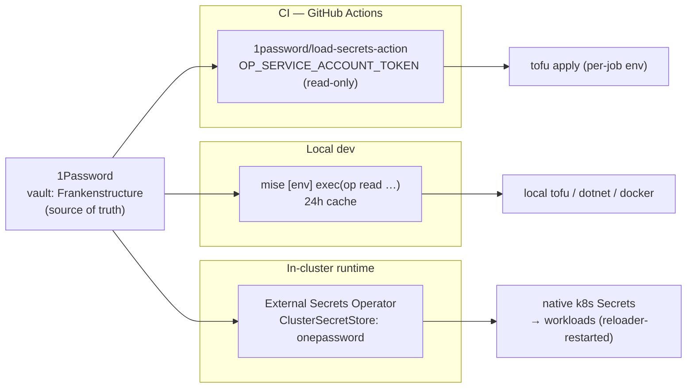
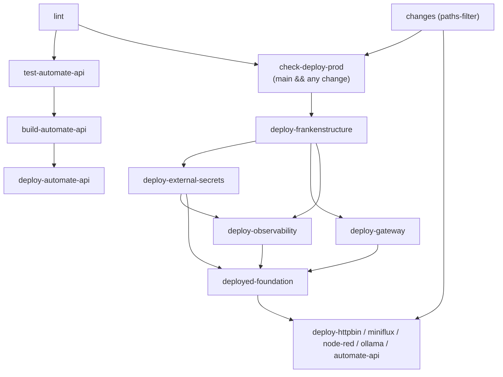

# Config, Secrets & CI/CD Architecture

How configuration, secrets, and deployments flow through this monorepo. Audience:
an engineer new to the repo who needs to add a secret, change config, or
understand why a deploy ran (or didn't).

## Overview

Four tools carry the weight:

- **1Password** (vault [`Frankenstructure`](#source-of-truth)) — the single
  source of truth for every secret.
- **`mise`** (`.mise.toml`) — local developer environment and config; reads
  secrets from 1Password on demand and caches them.
- **`doit`** (`dodo.py`) — workspace task runner (`setup`, `lint`, `build`,
  `start`).
- **Terraform / OpenTofu** — infrastructure and apps, normally applied via
  GitHub Actions GitOps on push to `main`; local `tofu apply` is also safe
  because S3 state locking (`use_lockfile`) serializes writes.

Secrets leave 1Password through exactly **three consumption paths**, each
authenticating differently but sharing one address format
(`op://Frankenstructure/<item>/<field>`):



The **secret-zero** that bootstraps the in-cluster path (the ESO service-account
token) is the same read-only token CI already uses — see
[Secret-zero](#secret-zero-bootstrapping-eso).

---

## Secrets management

### Source of truth

All secrets live in the 1Password vault **`Frankenstructure`**. Every path
references them with the standard 1Password secret-reference format:

```
op://Frankenstructure/<item title>/[<section>/]<field>
```

Examples in active use:

- `op://Frankenstructure/Vultr API Key/password`
- `op://Frankenstructure/Honeycomb.io Management API Key/credential`
- `op://Frankenstructure/ProtonMail SMTP - Monitoring/SMTP/password` — note the
  optional `<section>` (`SMTP`) segment.

This one address format is shared verbatim across CI, local dev, and (with the
vault stripped) the in-cluster ESO path, so a secret's coordinates are the same
wherever it is consumed.

### The three consumption paths

#### a. CI — GitHub Actions

Each deploy job pulls only the secrets it needs with
[`1password/load-secrets-action`](https://github.com/marketplace/actions/load-secrets-from-1password)
(pinned to `v4.0.1`), authenticated by the **read-only**
`OP_SERVICE_ACCOUNT_TOKEN` GitHub Actions secret. `export-env: false` keeps
secrets out of the shared process env — they are exposed as **masked step
outputs** and wired into the specific `tofu` step that needs them.

```yaml
- id: op-secrets
  uses: 1password/load-secrets-action@…# v4.0.1
  with:
    export-env: false
  env:
    OP_SERVICE_ACCOUNT_TOKEN: ${{ secrets.OP_SERVICE_ACCOUNT_TOKEN }}
    honeycomb_key_id: op://Frankenstructure/Honeycomb.io Management API Key/username
    honeycomb_key_secret: op://Frankenstructure/Honeycomb.io Management API Key/credential
    # …later…
    TF_VAR_honeycomb_key_id: ${{ steps.op-secrets.outputs.honeycomb_key_id }}
```

There is **no init-secrets job, no inter-job secret relay, and no GPG**. An
earlier design relayed secrets between jobs via GPG; it was removed because
`load-secrets-action` already masks outputs, so each job simply re-fetches what
it needs.

#### b. Local dev — `mise`

`.mise.toml` `[env]` resolves secrets at shell-entry with templated
`exec(op read …)`, cached per-machine in `~/.cache/mise` (shared across
terminals) for **24h** via `cache_key` + `cache_duration`:

```toml
VULTR_API_KEY = "{{ exec(command=\"op read 'op://Frankenstructure/Vultr API Key/password'\", cache_key='vultr_api_key', cache_duration='24h') }}"
```

The same `op://` paths the CI uses appear here as `TF_VAR_*` values, so local
`tofu plan` sees the same inputs CI does. Force a refresh with
`mise cache clear`.

#### c. In-cluster runtime — External Secrets Operator (ESO)

The [`external-secrets`](../terraform/infrastructure/external-secrets/) stack
installs ESO and a single `ClusterSecretStore` named **`onepassword`** using the
**`onepasswordSDK`** provider, pointed at the `Frankenstructure` vault:

```yaml
# cluster_secret_store.yaml
spec:
  provider:
    onepasswordSDK:
      vault: Frankenstructure
      auth:
        serviceAccountSecretRef:
          name: onepassword-sdk-token
          namespace: external-secrets
          key: token
```

Application stacks declare `ExternalSecret` CRs that ESO reconciles into native
Kubernetes `Secret`s. `stakater/reloader` watches those Secrets and triggers a
rolling restart of annotated workloads when ESO rotates a value. See the
[external-secrets module README](../terraform/infrastructure/external-secrets/README.md)
for the full runbook.

### Secret-zero (bootstrapping ESO)

ESO needs one credential it cannot source through itself — the 1Password
service-account token (chicken-and-egg). That **secret-zero** is the **same
read-only `OP_SERVICE_ACCOUNT_TOKEN`** CI already holds. The external-secrets
stack seeds it as the `onepassword-sdk-token` Kubernetes Secret from a CI-injected
Terraform variable:

```hcl
# terraform/infrastructure/external-secrets/secrets.tf
resource "kubernetes_secret" "onepassword_sdk_token" {
  metadata { name = "onepassword-sdk-token", namespace = "external-secrets" }
  data = { token = var.op_service_account_token } # TF_VAR_op_service_account_token = secrets.OP_SERVICE_ACCOUNT_TOKEN
}
```

Every other in-cluster secret derives from this one.

### The mixed-source rule

Not every secret belongs in ESO. The deciding question is **where the value is
born**:

| Secret origin                            | Lives in      | Why                                                                    |
| ---------------------------------------- | ------------- | ---------------------------------------------------------------------- |
| Pure 1Password lookup (`op://…` only)    | **ESO**       | Static credential; ESO syncs + reloader rotates with no TF round-trip. |
| Generated by the Vultr provider at apply | **Terraform** | Value doesn't exist until `tofu apply` creates the resource.           |
| Generated by another provider at apply   | **Terraform** | Same — the provider, not 1Password, is the source.                     |
| Local-only / derived from a CLI          | **mise**      | Convenience for local tooling; never needed in-cluster.                |

Representative mapping:

| Secret                                       | Path          | Detail                                                            |
| -------------------------------------------- | ------------- | ----------------------------------------------------------------- |
| AutoMate `DROPBOX_*` / `TODOIST_*` OAuth     | **ESO**       | `automate-onepassword` ExternalSecret (`automate` ns)             |
| Miniflux `ADMIN_USERNAME` / `ADMIN_PASSWORD` | **ESO**       | `miniflux-admin` ExternalSecret (`miniflux` ns)                   |
| Grafana Cloud `api-key` / `instance-id`      | **ESO**       | `grafana-cloud` ExternalSecret (`observability` ns)               |
| AutoMate `DATABASE_*` (host/user/pw/port)    | **Terraform** | Derived from `vultr_database_*` resources at apply (`secrets.tf`) |
| Honeycomb `prod-ingest` ingest key           | **Terraform** | `honeycombio_api_key.prod_ingest` — provider-generated            |
| `AWS_*` (S3) / `REGISTRY` (local)            | **mise**      | Derived from `vultr` CLI; local-only, no TTL cache                |

> Note the asymmetry for Postgres: the **admin password input**
> (`TF_VAR_automate_postgres_password`) is an `op://` lookup, but the **connection
> string the app consumes** (`DATABASE_*`) is assembled by Terraform from the
> live `vultr_database_*` resources, so it stays Terraform-managed.

---

## 1Password Connect for ESO (Family-plan daily-cap fix)

> Supersedes the `onepasswordSDK` description in
> [the in-cluster path](#c-in-cluster-runtime--external-secrets-operator-eso) and
> [Secret-zero](#secret-zero-bootstrapping-eso) above: ESO no longer reads
> 1Password's cloud API directly.

**Problem.** On the 1Password **Families** plan, service-account rate limits are
**1,000 read+write/day per _account_** — account-wide and shared across every
token, **not** per-token. ESO reconciling 3 ExternalSecrets (9 keys) every `1h`
burned ~216+ reads/day around the clock (~22% of the cap, 24/7); combined with CI
bursts this exhausted the daily cap, and CI started failing with **HTTP 429** from
`1password/load-secrets-action`. Diagnose with
`op service-account ratelimit --format=json` (the `account` / `read_write` row).

**Fix.** ESO now reads through **1Password Connect** (Secrets Automation),
self-hosted in the `frank8s` cluster (ns `external-secrets`, Helm chart `connect`
from `https://1password.github.io/connect-helm-charts`). Connect caches the vault
in-cluster and serves reads from that cache, so ESO reads **no longer count
against the per-account daily cap** — only 1Password's internal stability limits
apply. Connect is confirmed available on the Families plan.

The `ClusterSecretStore` `onepassword` switched from the **`onepasswordSDK`**
provider to the **`onepassword`** Connect provider; the **3 ExternalSecrets are
unchanged** (they reference the store by name):

```yaml
# cluster_secret_store.yaml
spec:
  provider:
    onepassword:
      connectHost: "http://onepassword-connect:8080"
      vaults: { Frankenstructure: 1 }
      auth:
        secretRef:
          connectTokenSecretRef:
            name: onepassword-connect-token
            key: token
            namespace: external-secrets
```

### New secret-zero

Connect needs two bootstrap credentials ESO cannot source through itself — the
`1password-credentials.json` file and a Connect access token — stored at:

- `op://Frankenstructure/1Password Connect - Secrets Automation/credentials_json`
- `op://Frankenstructure/1Password Connect - Secrets Automation/credential`

CI injects them into the `deploy-external-secrets` job as
`TF_VAR_op_connect_credentials_json` / `TF_VAR_op_connect_token`, which become two
`kubernetes_secret`s (`onepassword-connect-credentials`,
`onepassword-connect-token`).

> The credentials-file content is stored **verbatim** —
> `kubernetes_secret.data` base64-encodes it and k8s decodes back to raw JSON on
> mount, so **do not pre-base64** the value.

The legacy `onepassword-sdk-token` Secret (`var.op_service_account_token`)
**remains for now** and can be dropped once Connect is verified healthy in
production.

### CI keeps its service accounts

CI still uses service accounts (`load-secrets-action`) for its own `op://` reads;
with ESO off the cloud path, CI now has the full ~1,000/day to itself. The
`OP_SERVICE_ACCOUNT_TOKEN` GitHub secret stays (it authenticates CI's own
`load-secrets-action`). To shave PR-time reads, `build-automate-api`'s secret
fetch + docker login are now gated to `main`
(`if: github.ref_name == 'main'`).

> **Deferred (optional):** a day-keyed encrypted GitHub Actions cache for CI
> secret loading would make re-run storms free, but is **not yet implemented** —
> it needs an `OP_CACHE_KEY` repo secret.

---

## Config management

### `.mise.toml`

- **Identity & paths** — `KUBECONFIG`/`KUBECONFIG_PATH` →
  `secrets/frank8s.yaml`; `GITHUB_USERNAME` from `git config user.email`.
- **Remote secrets (24h TTL)** — `VULTR_API_KEY`, `CLOUDFLARE_API_TOKEN`, and
  the `TF_VAR_*` family, each an `op read` cached for 24h.
- **Vultr-CLI-derived (no-TTL, local-only)** — `AWS_ACCESS_KEY_ID`,
  `AWS_SECRET_ACCESS_KEY`, `REGISTRY` are computed from
  `vultr … object-storage list` / `container-registry list` piped through `jq`.
  These replace the deleted `secrets/frankenstorage.yaml` and
  `secrets/frankistry.json` files; the cache is shared cross-terminal in
  `~/.cache/mise`.

> In CI the S3 backend credentials are **not** the Vultr-CLI-derived `AWS_*`;
> they come straight from `op://Frankenstructure/Vultr Object Storage - Frankenstorage/{access_key,secret_key}`.

### `.mise/setup.sh` (hooks.enter)

Irreducible side effects that can't be declarative `[env]` exports, each guarded
to be a no-op after first success:

1. Writes the kubeconfig to `secrets/frank8s.yaml` (fetched via the Vultr CLI).
   Refresh by deleting the file.
2. `docker login ghcr.io` (uses `GITHUB_USERNAME` / `GITHUB_TOKEN`).
3. `docker login` to the Vultr container registry (`frankistry`).

### `doit` task runner

`dodo.py` (pydoit) defines workspace tasks and auto-discovers per-project
sub-tasks. Current projects: `automate` (F#/api), `frankenstructure` and
`gateway` (Terraform/infra).

| Command      | Purpose                                                       |
| ------------ | ------------------------------------------------------------- |
| `doit ls`    | List projects and sub-tasks (the default task).               |
| `doit setup` | Root setup (`mise install`, `pre-commit install`) + projects. |
| `doit lint`  | Run all linters via `pre-commit`.                             |
| `doit build` | Build projects (filter with `$LANGUAGE/$CATEGORY/$PROJECT`).  |
| `doit start` | Run projects.                                                 |

---

## CI/CD architecture

`.github/workflows/cicd.yaml` is one workflow triggered on **push to `main`**
and on **pull_request**. PRs run the gates (lint, change detection, test, build)
but never deploy — the image push and every `deploy-*` job is gated on
`github.ref_name == 'main'`.

### Job graph



- **`changes`** (`dorny/paths-filter`) emits per-app booleans (`httpbin`,
  `miniflux`, `node-red`, `ollama`, `automate`) plus `any`. Each app's
  `deploy-*` job is `if: needs.changes.outputs.<app> == 'true'`, so only changed
  stacks redeploy. `.github/workflows/cicd.yaml` and `.mise.toml` are in the
  `any` filter (and shared modules feed the relevant apps).
- **`check-deploy-prod`** is the production gate:
  `if: github.ref_name == 'main' && needs.changes.outputs.any == 'true'` with
  `environment: production`. All `deploy-*` jobs descend from it.
- **Foundation tier** (always applies when the gate passes):
  `deploy-frankenstructure` → (`deploy-external-secrets`, `deploy-gateway`,
  `deploy-observability`) → `deployed-foundation`. **`deploy-observability`
  carries an explicit `needs: deploy-external-secrets`** because its
  `grafana-cloud` ExternalSecret requires the ESO CRDs + ClusterSecretStore to
  exist first (gateway has no such dependency and runs frankenstructure-parallel).
- **App tier** — every app `deploy-*` job `needs: [deployed-foundation, changes]`
  (and `deploy-automate-api` additionally `needs: build-automate-api`). Because
  `deployed-foundation ⊇ deploy-external-secrets`, apps are guaranteed the ESO
  store exists before their ExternalSecrets reconcile.
- Each deploy job is serialized by a per-job `concurrency.group`
  (`cancel-in-progress: false`).

### GitOps & state

- **Applied by CI on push to `main` (GitOps)** as the standard path. Local
  `tofu apply` is also safe — `use_lockfile` state locking serializes writes —
  so it is no longer prohibited.
- **Remote state: Vultr Object Storage** (S3-compatible, `sjc1.vultrobjects.com`,
  bucket `frankenstructure`, region `us-west-1`) with **`use_lockfile = true`**
  for state locking (Vultr honors S3 conditional writes).
- **Branch protection: squash-merge only** (no merge commits).
- **PRs are opened and merged via the GitHub MCP** — the `gh` PAT in this
  environment lacks PR-write / merge scope.

---

## Key decisions & gotchas (the WHY)

| Decision / gotcha                                     | Detail                                                                                                                                                                 |
| ----------------------------------------------------- | ---------------------------------------------------------------------------------------------------------------------------------------------------------------------- |
| **Per-job `load-secrets-action`, not a relay**        | Each job re-fetches its own secrets with masked outputs (`export-env: false`). Replaced a former GPG inter-job relay — redundant once outputs are masked.              |
| **ESO + `onepasswordSDK` + secret-zero**              | In-cluster secrets sync from 1Password via the `onepassword` ClusterSecretStore; the one bootstrap token is the reused read-only `OP_SERVICE_ACCOUNT_TOKEN`.           |
| **`remoteRef.key` form `"<item>/[section/]<field>"`** | The `onepasswordSDK` provider has **no separate `property` field** — encode the field into `key`. The vault comes from the store, so it is omitted from the CR.        |
| **`kbst kustomization_resource` for CRs**             | `kubernetes_manifest` does a server-side dry-run at **plan** time, which fails when the target CRD isn't installed yet. `kustomization_resource` defers to apply time. |
| **OTel-operator vs reloader**                         | OTel collectors are **intentionally not** `reloader`-annotated to avoid fighting the operator's own management; operator-native secret rotation is a future task.      |
| **`optional = false` on `envFrom`**                   | Workloads fail loudly if an ESO-synced Secret is missing, rather than starting with a silently empty env.                                                              |
| **Observability needs `deploy-external-secrets`**     | Its `grafana-cloud` ExternalSecret needs the ESO CRDs + store first; added as an explicit `needs` (it otherwise runs foundation-parallel).                             |
| **Reloader auto-restart**                             | `reloader.stakater.com/auto: "true"` on the AutoMate Deployment and Miniflux pods picks up rotated ESO Secrets without a manual rollout.                               |

---

## How to add a new secret

Decide by **where the value is born**:

1. **Pure 1Password lookup** (a static credential that already lives in the
   vault) → add an **ESO `ExternalSecret`**. Follow the runbook in the
   [external-secrets module README](../terraform/infrastructure/external-secrets/README.md).
2. **Generated by a provider at apply** (Vultr DB password/connection string,
   Honeycomb ingest key, etc.) → keep it **Terraform-managed** next to the
   resource that produces it.
3. **Local-only / CLI-derived** (needed only for local tooling) → add a cached
   `exec()` entry to **`.mise.toml`**.

---

## See also

- [external-secrets module README](../terraform/infrastructure/external-secrets/README.md)
  — ESO operations + add-an-ExternalSecret runbook.
- [observability README](../terraform/infrastructure/observability/README.md) —
  telemetry collection and the `grafana-cloud` ExternalSecret consumer.
- Root [`README.md`](../README.md) · [`AGENTS.md`](../AGENTS.md).
